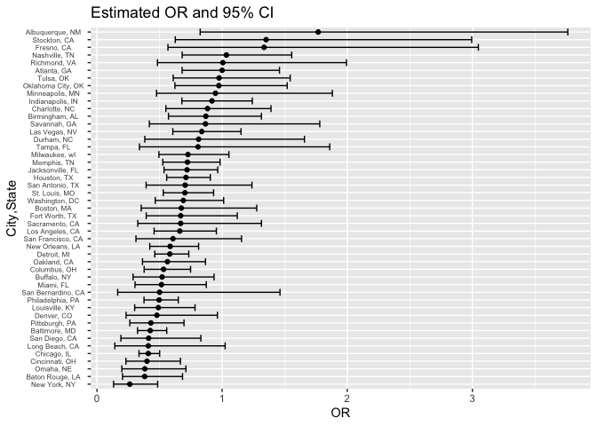
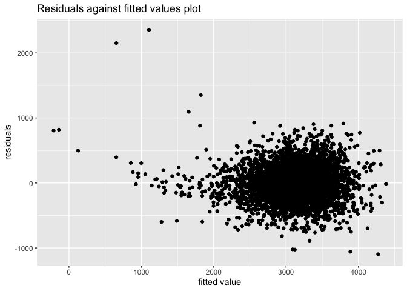

p8105_hw6_jy3269
================
Jingyi Yao
2022-11-29

## Problem 2

### 1. Create `city_state` variable and a binary `solved` variable

``` r
raw_data <- read_csv("./data/homicide-data.csv",show_col_types = FALSE)
homicide <- raw_data %>% 
  mutate(
    city_state = str_c(city,", ",state),
    solved = ifelse(disposition == "Closed by arrest",1,0)) %>% 
  mutate(
      victim_sex = fct_relevel(victim_sex, "Female"),
      victim_race = fct_relevel(victim_race, "White"),
         ) 

homicide
```

    ## # A tibble: 52,179 × 14
    ##    uid   repor…¹ victi…² victi…³ victi…⁴ victi…⁵ victi…⁶ city  state   lat   lon
    ##    <chr>   <dbl> <chr>   <chr>   <fct>   <chr>   <fct>   <chr> <chr> <dbl> <dbl>
    ##  1 Alb-…  2.01e7 GARCIA  JUAN    Hispan… 78      Male    Albu… NM     35.1 -107.
    ##  2 Alb-…  2.01e7 MONTOYA CAMERON Hispan… 17      Male    Albu… NM     35.1 -107.
    ##  3 Alb-…  2.01e7 SATTER… VIVIANA White   15      Female  Albu… NM     35.1 -107.
    ##  4 Alb-…  2.01e7 MENDIO… CARLOS  Hispan… 32      Male    Albu… NM     35.1 -107.
    ##  5 Alb-…  2.01e7 MULA    VIVIAN  White   72      Female  Albu… NM     35.1 -107.
    ##  6 Alb-…  2.01e7 BOOK    GERALD… White   91      Female  Albu… NM     35.2 -107.
    ##  7 Alb-…  2.01e7 MALDON… DAVID   Hispan… 52      Male    Albu… NM     35.1 -107.
    ##  8 Alb-…  2.01e7 MALDON… CONNIE  Hispan… 52      Female  Albu… NM     35.1 -107.
    ##  9 Alb-…  2.01e7 MARTIN… GUSTAVO White   56      Male    Albu… NM     35.1 -107.
    ## 10 Alb-…  2.01e7 HERRERA ISRAEL  Hispan… 43      Male    Albu… NM     35.1 -107.
    ## # … with 52,169 more rows, 3 more variables: disposition <chr>,
    ## #   city_state <chr>, solved <dbl>, and abbreviated variable names
    ## #   ¹​reported_date, ²​victim_last, ³​victim_first, ⁴​victim_race, ⁵​victim_age,
    ## #   ⁶​victim_sex

## 2. Omit cities : Dallas, TX; Phoenix, AZ; and Kansas City, MO and Tulsa, AL

``` r
homicide <- homicide %>% 
  filter(city_state != "Dallas, TX", city_state != "Phoenix, AZ", city_state != "Kansas City, MO", city_state != "Tulsa, AL")
```

## 3. Limit your analysis those for whom victim_race is white or black

``` r
homicide <- homicide %>% 
  filter(victim_race == "White" | victim_race == "Black") %>% 
  mutate(victim_age = as.numeric(victim_age))
```

    ## Warning in mask$eval_all_mutate(quo): NAs introduced by coercion

## 4. Select the predictors and response variable in Baltimore

``` r
baltimore_df = 
  homicide %>% 
  filter(city == "Baltimore") %>% 
  select(solved, victim_age, victim_race, victim_sex)

baltimore_df
```

    ## # A tibble: 2,753 × 4
    ##    solved victim_age victim_race victim_sex
    ##     <dbl>      <dbl> <fct>       <fct>     
    ##  1      0         17 Black       Male      
    ##  2      0         26 Black       Male      
    ##  3      0         21 Black       Male      
    ##  4      1         61 White       Male      
    ##  5      1         46 Black       Male      
    ##  6      1         27 Black       Male      
    ##  7      1         21 Black       Male      
    ##  8      1         16 Black       Male      
    ##  9      1         21 Black       Male      
    ## 10      1         44 Black       Female    
    ## # … with 2,743 more rows

## 5. Fit logistic regression for Baltimore

``` r
Baltimore_logistic = 
  baltimore_df %>% 
  glm(solved ~ victim_age + victim_race + victim_sex, data = ., family = binomial())
```

## 6. Save the Baltimore model result as an R Object

``` r
save(Baltimore_logistic, file = "./result/Baltimore_logistic.RData")
```

## 7. Tidy the object

``` r
Baltimore_logistic %>% 
  broom::tidy() %>% 
  knitr::kable(digits = 3)
```

| term             | estimate | std.error | statistic | p.value |
|:-----------------|---------:|----------:|----------:|--------:|
| (Intercept)      |    1.152 |     0.237 |     4.865 |   0.000 |
| victim_age       |   -0.007 |     0.003 |    -2.024 |   0.043 |
| victim_raceBlack |   -0.842 |     0.175 |    -4.818 |   0.000 |
| victim_sexMale   |   -0.854 |     0.138 |    -6.184 |   0.000 |

## 8. Get the 95% CI of OR and comparing male victims to female victims

``` r
alpha = 0.05

Baltimore_logistic %>% 
  broom::tidy() %>%
  mutate(OR = exp(estimate),
         OR_lower_bound = exp(estimate - qnorm(1 - alpha/2) * std.error),
         OR_upper_bound = exp(estimate + qnorm(1 - alpha/2) * std.error)) %>%
  filter(term == 'victim_sexMale') %>% 
  select(estimate, OR,OR_lower_bound,OR_upper_bound) %>% 
  knitr::kable(digits = 3)
```

| estimate |    OR | OR_lower_bound | OR_upper_bound |
|---------:|------:|---------------:|---------------:|
|   -0.854 | 0.426 |          0.325 |          0.558 |

## 9. Run `glm` for each of the cities

``` r
cities_logistic = 
  homicide %>% 
  select(city_state, victim_race:victim_sex, solved) %>% 
  nest(sample = victim_race:solved) %>% 
  mutate(
    models = map(sample, ~glm(solved ~ victim_age+victim_race+victim_sex, family= binomial(), data=.x)),
    results = map(models, broom::tidy),
    conf_int = map(models, ~confint(.x,"victim_sexMale"))
  ) %>% 
  select(city_state,results,conf_int) %>% 
  unnest(results) %>% 
  unnest_wider(conf_int) %>% 
  filter(term == "victim_sexMale") %>% 
  select(city_state,estimate,`2.5 %`,`97.5 %`) %>% 
  mutate(
    OR = exp(estimate),
    OR_lower_bound = exp(`2.5 %`),
    OR_upper_bound = exp(`97.5 %`)
    ) %>% 
  select(city_state,estimate,OR,OR_lower_bound,OR_upper_bound) 
```

``` r
cities_logistic %>% knitr::kable(digits = 3)
```

| city_state         | estimate |    OR | OR_lower_bound | OR_upper_bound |
|:-------------------|---------:|------:|---------------:|---------------:|
| Albuquerque, NM    |    0.570 | 1.767 |          0.825 |          3.762 |
| Atlanta, GA        |    0.000 | 1.000 |          0.680 |          1.458 |
| Baltimore, MD      |   -0.854 | 0.426 |          0.324 |          0.558 |
| Baton Rouge, LA    |   -0.964 | 0.381 |          0.204 |          0.684 |
| Birmingham, AL     |   -0.139 | 0.870 |          0.571 |          1.314 |
| Boston, MA         |   -0.395 | 0.674 |          0.353 |          1.277 |
| Buffalo, NY        |   -0.653 | 0.521 |          0.288 |          0.936 |
| Charlotte, NC      |   -0.123 | 0.884 |          0.551 |          1.391 |
| Chicago, IL        |   -0.891 | 0.410 |          0.336 |          0.501 |
| Cincinnati, OH     |   -0.917 | 0.400 |          0.231 |          0.667 |
| Columbus, OH       |   -0.630 | 0.532 |          0.377 |          0.748 |
| Denver, CO         |   -0.736 | 0.479 |          0.233 |          0.962 |
| Detroit, MI        |   -0.541 | 0.582 |          0.462 |          0.734 |
| Durham, NC         |   -0.208 | 0.812 |          0.382 |          1.658 |
| Fort Worth, TX     |   -0.402 | 0.669 |          0.394 |          1.121 |
| Fresno, CA         |    0.289 | 1.335 |          0.567 |          3.048 |
| Houston, TX        |   -0.341 | 0.711 |          0.557 |          0.906 |
| Indianapolis, IN   |   -0.085 | 0.919 |          0.678 |          1.241 |
| Jacksonville, FL   |   -0.329 | 0.720 |          0.536 |          0.965 |
| Las Vegas, NV      |   -0.178 | 0.837 |          0.606 |          1.151 |
| Long Beach, CA     |   -0.891 | 0.410 |          0.143 |          1.024 |
| Los Angeles, CA    |   -0.413 | 0.662 |          0.457 |          0.954 |
| Louisville, KY     |   -0.712 | 0.491 |          0.301 |          0.784 |
| Memphis, TN        |   -0.324 | 0.723 |          0.526 |          0.984 |
| Miami, FL          |   -0.663 | 0.515 |          0.304 |          0.873 |
| Milwaukee, wI      |   -0.319 | 0.727 |          0.495 |          1.054 |
| Minneapolis, MN    |   -0.054 | 0.947 |          0.476 |          1.881 |
| Nashville, TN      |    0.034 | 1.034 |          0.681 |          1.556 |
| New Orleans, LA    |   -0.536 | 0.585 |          0.422 |          0.812 |
| New York, NY       |   -1.338 | 0.262 |          0.133 |          0.485 |
| Oakland, CA        |   -0.574 | 0.563 |          0.364 |          0.867 |
| Oklahoma City, OK  |   -0.026 | 0.974 |          0.623 |          1.520 |
| Omaha, NE          |   -0.961 | 0.382 |          0.199 |          0.711 |
| Philadelphia, PA   |   -0.701 | 0.496 |          0.376 |          0.650 |
| Pittsburgh, PA     |   -0.842 | 0.431 |          0.263 |          0.696 |
| Richmond, VA       |    0.006 | 1.006 |          0.483 |          1.994 |
| San Antonio, TX    |   -0.350 | 0.705 |          0.393 |          1.238 |
| Sacramento, CA     |   -0.402 | 0.669 |          0.326 |          1.314 |
| Savannah, GA       |   -0.143 | 0.867 |          0.419 |          1.780 |
| San Bernardino, CA |   -0.692 | 0.500 |          0.166 |          1.462 |
| San Diego, CA      |   -0.884 | 0.413 |          0.191 |          0.830 |
| San Francisco, CA  |   -0.498 | 0.608 |          0.312 |          1.155 |
| St. Louis, MO      |   -0.352 | 0.703 |          0.530 |          0.932 |
| Stockton, CA       |    0.301 | 1.352 |          0.626 |          2.994 |
| Tampa, FL          |   -0.214 | 0.808 |          0.340 |          1.860 |
| Tulsa, OK          |   -0.025 | 0.976 |          0.609 |          1.544 |
| Washington, DC     |   -0.371 | 0.690 |          0.465 |          1.012 |

``` r
ggplot(cities_logistic, aes(y = fct_reorder(city_state, OR), x = OR)) +
  geom_point() +
  geom_errorbar(aes(xmin = OR_lower_bound, xmax = OR_upper_bound)) +
  labs(title = "Estimated OR and 95% CI", ) + ylab("City,State") + theme(axis.text.y = element_text(hjust = 0.5,size = 6))
```

<!-- -->

Comments on the plot :

-   Most of the estimated OR is less than 1. Thus, in most cities, the
    homicide whose victim is a male is less likely to be solved compared
    to those with a female victim.
-   Albuquerque, Stockton, Fresno, Nashville and Richmond have an
    estimated OR that is above 1. However, their 95% CI contains 1.
    Thus, we cannot conclude that there is significant difference
    between the odds of solving homicides for male and female victims in
    these cities.
-   Some cities’ 95% CI does not contain 1, which means that there are
    significant difference between the odds of solving homicides for
    male and female victims in these cities. For example, New York,
    Chicago are cities with CI that does not contain 1.

## Problem 3

``` r
data <- read_csv("./data/birthweight.csv")

data
```

    ## # A tibble: 4,342 × 20
    ##    babysex bhead blength   bwt delwt fincome frace gaweeks malform menarche
    ##      <dbl> <dbl>   <dbl> <dbl> <dbl>   <dbl> <dbl>   <dbl>   <dbl>    <dbl>
    ##  1       2    34      51  3629   177      35     1    39.9       0       13
    ##  2       1    34      48  3062   156      65     2    25.9       0       14
    ##  3       2    36      50  3345   148      85     1    39.9       0       12
    ##  4       1    34      52  3062   157      55     1    40         0       14
    ##  5       2    34      52  3374   156       5     1    41.6       0       13
    ##  6       1    33      52  3374   129      55     1    40.7       0       12
    ##  7       2    33      46  2523   126      96     2    40.3       0       14
    ##  8       2    33      49  2778   140       5     1    37.4       0       12
    ##  9       1    36      52  3515   146      85     1    40.3       0       11
    ## 10       1    33      50  3459   169      75     2    40.7       0       12
    ## # … with 4,332 more rows, and 10 more variables: mheight <dbl>, momage <dbl>,
    ## #   mrace <dbl>, parity <dbl>, pnumlbw <dbl>, pnumsga <dbl>, ppbmi <dbl>,
    ## #   ppwt <dbl>, smoken <dbl>, wtgain <dbl>

### 1. Clean the data for regression analysis

``` r
birthwt <- data %>% 
  mutate(
    frace = recode(frace, `1` = "White", `2` = "Black", `3` = "Asian", `4` = "Puerto Rican", `8` = "Other", `9` = "Unknown"),
    mrace = recode(mrace, `1` = "White", `2` = "Black", `3` = "Asian", `4` = "Puerto Rican", `8` = "Other"),
    babysex = recode(babysex, `1` = "Male", `2` = "Female")
    ) %>% 
    filter(frace != "Unknown") %>% 
  mutate(
    frace = fct_relevel(frace, "White"),
    mrace = fct_relevel(mrace, "White"),
    babysex = fct_relevel(babysex,"Female")
         ) %>% 
  select(bwt,everything())

birthwt
```

    ## # A tibble: 4,342 × 20
    ##      bwt babysex bhead blength delwt fincome frace gaweeks malform menarche
    ##    <dbl> <fct>   <dbl>   <dbl> <dbl>   <dbl> <fct>   <dbl>   <dbl>    <dbl>
    ##  1  3629 Female     34      51   177      35 White    39.9       0       13
    ##  2  3062 Male       34      48   156      65 Black    25.9       0       14
    ##  3  3345 Female     36      50   148      85 White    39.9       0       12
    ##  4  3062 Male       34      52   157      55 White    40         0       14
    ##  5  3374 Female     34      52   156       5 White    41.6       0       13
    ##  6  3374 Male       33      52   129      55 White    40.7       0       12
    ##  7  2523 Female     33      46   126      96 Black    40.3       0       14
    ##  8  2778 Female     33      49   140       5 White    37.4       0       12
    ##  9  3515 Male       36      52   146      85 White    40.3       0       11
    ## 10  3459 Male       33      50   169      75 Black    40.7       0       12
    ## # … with 4,332 more rows, and 10 more variables: mheight <dbl>, momage <dbl>,
    ## #   mrace <fct>, parity <dbl>, pnumlbw <dbl>, pnumsga <dbl>, ppbmi <dbl>,
    ## #   ppwt <dbl>, smoken <dbl>, wtgain <dbl>

## 2. Fit a full model and using stepwise method to select variables

``` r
# Fit the full model 
full_model <- lm(bwt ~., data = birthwt)

# begin stepwise procedure
stepwise_model <- MASS::stepAIC(full_model, direction = "backward", trace = FALSE)
summary(stepwise_model)
```

    ## 
    ## Call:
    ## lm(formula = bwt ~ babysex + bhead + blength + delwt + fincome + 
    ##     gaweeks + mheight + mrace + parity + ppwt + smoken, data = birthwt)
    ## 
    ## Residuals:
    ##      Min       1Q   Median       3Q      Max 
    ## -1097.18  -185.52    -3.39   174.14  2353.44 
    ## 
    ## Coefficients:
    ##                     Estimate Std. Error t value Pr(>|t|)    
    ## (Intercept)       -6070.2639   136.9081 -44.338  < 2e-16 ***
    ## babysexMale         -28.5580     8.4549  -3.378 0.000737 ***
    ## bhead               130.7770     3.4466  37.944  < 2e-16 ***
    ## blength              74.9471     2.0190  37.120  < 2e-16 ***
    ## delwt                 4.1067     0.3921  10.475  < 2e-16 ***
    ## fincome               0.3180     0.1747   1.820 0.068844 .  
    ## gaweeks              11.5925     1.4621   7.929 2.79e-15 ***
    ## mheight               6.5940     1.7849   3.694 0.000223 ***
    ## mraceAsian          -74.8868    42.3146  -1.770 0.076837 .  
    ## mraceBlack         -138.7925     9.9071 -14.009  < 2e-16 ***
    ## mracePuerto Rican  -100.6781    19.3247  -5.210 1.98e-07 ***
    ## parity               96.3047    40.3362   2.388 0.017004 *  
    ## ppwt                 -2.6756     0.4274  -6.261 4.20e-10 ***
    ## smoken               -4.8434     0.5856  -8.271  < 2e-16 ***
    ## ---
    ## Signif. codes:  0 '***' 0.001 '**' 0.01 '*' 0.05 '.' 0.1 ' ' 1
    ## 
    ## Residual standard error: 272.3 on 4328 degrees of freedom
    ## Multiple R-squared:  0.7181, Adjusted R-squared:  0.7173 
    ## F-statistic: 848.1 on 13 and 4328 DF,  p-value: < 2.2e-16

``` r
birthwt %>%  
  add_predictions(stepwise_model) %>% 
  add_residuals(stepwise_model) %>% 
  ggplot(aes(x = pred, y = resid)) + geom_point() +
  labs(title = "Residuals against fitted values plot", ) + xlab("fitted value") + ylab("residuals")
```

<!-- -->

``` r
#first create a dataframe 
cv_df =
  crossv_mc(birthwt, 100) %>% 
  mutate(
    train = map(train, as_tibble),
    test = map(test, as_tibble))

#then fit three models:
cv_df = 
  cv_df %>% 
  mutate(
    my_model  = map(train, ~lm( bwt ~ babysex + bhead + blength + delwt + fincome + 
    gaweeks + mheight + mrace + parity + ppwt + smoken, data = .x)),
    main_effect_model  = map(train, ~lm(bwt ~ gaweeks + blength, data = .x)),
    interactive_model  = map(train, ~lm(bwt ~ bhead*blength*babysex, data = .x))) %>% 
  mutate(
    rmse_my_model = map2_dbl(my_model, test, ~rmse(model = .x, data = .y)),
    rmse_main_effect    = map2_dbl(main_effect_model, test, ~rmse(model = .x, data = .y)),
    rmse_interactive = map2_dbl(interactive_model, test, ~rmse(model = .x, data = .y)))
```

    ## Warning in predict.lm(model, data): prediction from a rank-deficient fit may be
    ## misleading

``` r
#Get the summarize the result:
cv_df %>% 
  summarize(
    rmse_my_model_mean = mean(rmse_my_model),
    rmse_main_effect_mean = mean(rmse_main_effect),
    rmse_interactive_meam = mean(rmse_interactive)
  ) %>% knitr::kable()
```

| rmse_my_model_mean | rmse_main_effect_mean | rmse_interactive_meam |
|-------------------:|----------------------:|----------------------:|
|           272.7947 |               333.201 |              289.3828 |
