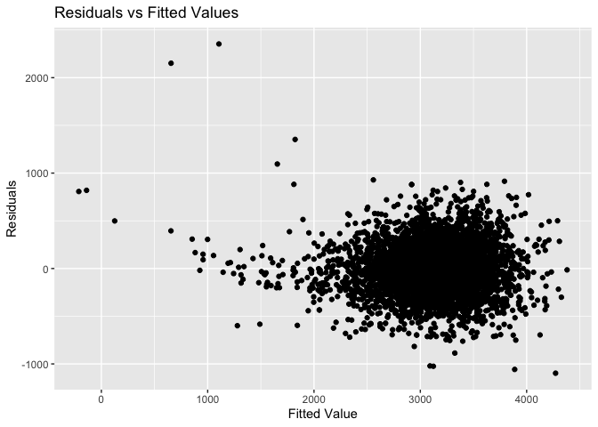
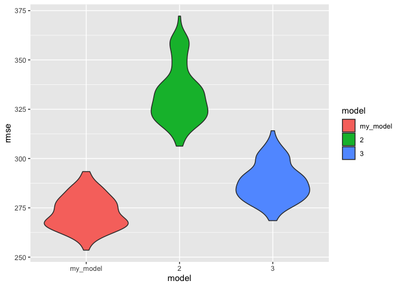

p8105_hw6_jy3269
================
Jingyi Yao
2022-11-30

## Problem 2

### 1. Create `city_state` variable and a binary `solved` variable

``` r
raw_data <- read_csv("./data/homicide-data.csv",show_col_types = FALSE)
homicide <- raw_data %>% 
  mutate(
    city_state = str_c(city,", ",state),
    solved = ifelse(disposition == "Closed by arrest",1,0)) %>% 
  mutate(
      victim_sex = fct_relevel(victim_sex, "Female"),
      victim_race = fct_relevel(victim_race, "White"),
         ) 

homicide
```

    ## # A tibble: 52,179 × 14
    ##    uid   repor…¹ victi…² victi…³ victi…⁴ victi…⁵ victi…⁶ city  state   lat   lon
    ##    <chr>   <dbl> <chr>   <chr>   <fct>   <chr>   <fct>   <chr> <chr> <dbl> <dbl>
    ##  1 Alb-…  2.01e7 GARCIA  JUAN    Hispan… 78      Male    Albu… NM     35.1 -107.
    ##  2 Alb-…  2.01e7 MONTOYA CAMERON Hispan… 17      Male    Albu… NM     35.1 -107.
    ##  3 Alb-…  2.01e7 SATTER… VIVIANA White   15      Female  Albu… NM     35.1 -107.
    ##  4 Alb-…  2.01e7 MENDIO… CARLOS  Hispan… 32      Male    Albu… NM     35.1 -107.
    ##  5 Alb-…  2.01e7 MULA    VIVIAN  White   72      Female  Albu… NM     35.1 -107.
    ##  6 Alb-…  2.01e7 BOOK    GERALD… White   91      Female  Albu… NM     35.2 -107.
    ##  7 Alb-…  2.01e7 MALDON… DAVID   Hispan… 52      Male    Albu… NM     35.1 -107.
    ##  8 Alb-…  2.01e7 MALDON… CONNIE  Hispan… 52      Female  Albu… NM     35.1 -107.
    ##  9 Alb-…  2.01e7 MARTIN… GUSTAVO White   56      Male    Albu… NM     35.1 -107.
    ## 10 Alb-…  2.01e7 HERRERA ISRAEL  Hispan… 43      Male    Albu… NM     35.1 -107.
    ## # … with 52,169 more rows, 3 more variables: disposition <chr>,
    ## #   city_state <chr>, solved <dbl>, and abbreviated variable names
    ## #   ¹​reported_date, ²​victim_last, ³​victim_first, ⁴​victim_race, ⁵​victim_age,
    ## #   ⁶​victim_sex

## 2. Omit cities : Dallas, TX; Phoenix, AZ; and Kansas City, MO and Tulsa, AL

``` r
homicide <- homicide %>% 
  filter(city_state != "Dallas, TX", city_state != "Phoenix, AZ", city_state != "Kansas City, MO", city_state != "Tulsa, AL")
```

## 3. Limit your analysis those for whom victim_race is white or black

``` r
homicide <- homicide %>% 
  filter(victim_race == "White" | victim_race == "Black") %>% 
  mutate(victim_age = as.numeric(victim_age))
```

    ## Warning in mask$eval_all_mutate(quo): NAs introduced by coercion

## 4. Select the predictors and response variable in Baltimore

``` r
baltimore_df = 
  homicide %>% 
  filter(city == "Baltimore") %>% 
  select(solved, victim_age, victim_race, victim_sex)

baltimore_df
```

    ## # A tibble: 2,753 × 4
    ##    solved victim_age victim_race victim_sex
    ##     <dbl>      <dbl> <fct>       <fct>     
    ##  1      0         17 Black       Male      
    ##  2      0         26 Black       Male      
    ##  3      0         21 Black       Male      
    ##  4      1         61 White       Male      
    ##  5      1         46 Black       Male      
    ##  6      1         27 Black       Male      
    ##  7      1         21 Black       Male      
    ##  8      1         16 Black       Male      
    ##  9      1         21 Black       Male      
    ## 10      1         44 Black       Female    
    ## # … with 2,743 more rows

## 5. Fit logistic regression for Baltimore

``` r
Baltimore_logistic = 
  baltimore_df %>% 
  glm(solved ~ victim_age + victim_race + victim_sex, data = ., family = binomial())
```

## 6. Save the Baltimore model result as an R Object

``` r
save(Baltimore_logistic, file = "./result/Baltimore_logistic.RData")
```

## 7. Tidy the object

``` r
Baltimore_logistic %>% 
  broom::tidy() %>% 
  knitr::kable(digits = 3)
```

| term             | estimate | std.error | statistic | p.value |
|:-----------------|---------:|----------:|----------:|--------:|
| (Intercept)      |    1.152 |     0.237 |     4.865 |   0.000 |
| victim_age       |   -0.007 |     0.003 |    -2.024 |   0.043 |
| victim_raceBlack |   -0.842 |     0.175 |    -4.818 |   0.000 |
| victim_sexMale   |   -0.854 |     0.138 |    -6.184 |   0.000 |

## 8. Get the 95% CI of OR

``` r
alpha = 0.05

Baltimore_logistic %>% 
  broom::tidy() %>%
  mutate(OR = exp(estimate),
         OR_lower_bound = exp(confint(Baltimore_logistic)[,1]),
         OR_upper_bound = exp(confint(Baltimore_logistic)[,2]) )%>%
  filter(term == 'victim_sexMale') %>% 
  select(estimate, OR,OR_lower_bound,OR_upper_bound) %>% 
  knitr::kable(digits = 3)
```

    ## Waiting for profiling to be done...
    ## Waiting for profiling to be done...

| estimate |    OR | OR_lower_bound | OR_upper_bound |
|---------:|------:|---------------:|---------------:|
|   -0.854 | 0.426 |          0.324 |          0.558 |

The OR result shows that male victims in the homicides have a lower
chance to have the case solved compared with women.

## 9. Run `glm` for each of the cities

``` r
cities_logistic = 
  homicide %>% 
  select(city_state, victim_race:victim_sex, solved) %>% 
  nest(sample = victim_race:solved) %>% 
  mutate(
    models = map(sample, ~glm(solved ~ victim_age+victim_race+victim_sex, family= binomial(), data=.x)),
    results = map(models, broom::tidy),
    conf_int = map(models, ~confint(.x,"victim_sexMale"))
  ) %>% 
  select(city_state,results,conf_int) %>% 
  unnest(results) %>% 
  unnest_wider(conf_int) %>% 
  filter(term == "victim_sexMale") %>% 
  select(city_state,estimate,`2.5 %`,`97.5 %`) %>% 
  mutate(
    OR = exp(estimate),
    OR_lower_bound = exp(`2.5 %`),
    OR_upper_bound = exp(`97.5 %`)
    ) %>% 
  select(city_state,estimate,OR,OR_lower_bound,OR_upper_bound) 
```

``` r
cities_logistic %>% knitr::kable(digits = 3)
```

| city_state         | estimate |    OR | OR_lower_bound | OR_upper_bound |
|:-------------------|---------:|------:|---------------:|---------------:|
| Albuquerque, NM    |    0.570 | 1.767 |          0.825 |          3.762 |
| Atlanta, GA        |    0.000 | 1.000 |          0.680 |          1.458 |
| Baltimore, MD      |   -0.854 | 0.426 |          0.324 |          0.558 |
| Baton Rouge, LA    |   -0.964 | 0.381 |          0.204 |          0.684 |
| Birmingham, AL     |   -0.139 | 0.870 |          0.571 |          1.314 |
| Boston, MA         |   -0.395 | 0.674 |          0.353 |          1.277 |
| Buffalo, NY        |   -0.653 | 0.521 |          0.288 |          0.936 |
| Charlotte, NC      |   -0.123 | 0.884 |          0.551 |          1.391 |
| Chicago, IL        |   -0.891 | 0.410 |          0.336 |          0.501 |
| Cincinnati, OH     |   -0.917 | 0.400 |          0.231 |          0.667 |
| Columbus, OH       |   -0.630 | 0.532 |          0.377 |          0.748 |
| Denver, CO         |   -0.736 | 0.479 |          0.233 |          0.962 |
| Detroit, MI        |   -0.541 | 0.582 |          0.462 |          0.734 |
| Durham, NC         |   -0.208 | 0.812 |          0.382 |          1.658 |
| Fort Worth, TX     |   -0.402 | 0.669 |          0.394 |          1.121 |
| Fresno, CA         |    0.289 | 1.335 |          0.567 |          3.048 |
| Houston, TX        |   -0.341 | 0.711 |          0.557 |          0.906 |
| Indianapolis, IN   |   -0.085 | 0.919 |          0.678 |          1.241 |
| Jacksonville, FL   |   -0.329 | 0.720 |          0.536 |          0.965 |
| Las Vegas, NV      |   -0.178 | 0.837 |          0.606 |          1.151 |
| Long Beach, CA     |   -0.891 | 0.410 |          0.143 |          1.024 |
| Los Angeles, CA    |   -0.413 | 0.662 |          0.457 |          0.954 |
| Louisville, KY     |   -0.712 | 0.491 |          0.301 |          0.784 |
| Memphis, TN        |   -0.324 | 0.723 |          0.526 |          0.984 |
| Miami, FL          |   -0.663 | 0.515 |          0.304 |          0.873 |
| Milwaukee, wI      |   -0.319 | 0.727 |          0.495 |          1.054 |
| Minneapolis, MN    |   -0.054 | 0.947 |          0.476 |          1.881 |
| Nashville, TN      |    0.034 | 1.034 |          0.681 |          1.556 |
| New Orleans, LA    |   -0.536 | 0.585 |          0.422 |          0.812 |
| New York, NY       |   -1.338 | 0.262 |          0.133 |          0.485 |
| Oakland, CA        |   -0.574 | 0.563 |          0.364 |          0.867 |
| Oklahoma City, OK  |   -0.026 | 0.974 |          0.623 |          1.520 |
| Omaha, NE          |   -0.961 | 0.382 |          0.199 |          0.711 |
| Philadelphia, PA   |   -0.701 | 0.496 |          0.376 |          0.650 |
| Pittsburgh, PA     |   -0.842 | 0.431 |          0.263 |          0.696 |
| Richmond, VA       |    0.006 | 1.006 |          0.483 |          1.994 |
| San Antonio, TX    |   -0.350 | 0.705 |          0.393 |          1.238 |
| Sacramento, CA     |   -0.402 | 0.669 |          0.326 |          1.314 |
| Savannah, GA       |   -0.143 | 0.867 |          0.419 |          1.780 |
| San Bernardino, CA |   -0.692 | 0.500 |          0.166 |          1.462 |
| San Diego, CA      |   -0.884 | 0.413 |          0.191 |          0.830 |
| San Francisco, CA  |   -0.498 | 0.608 |          0.312 |          1.155 |
| St. Louis, MO      |   -0.352 | 0.703 |          0.530 |          0.932 |
| Stockton, CA       |    0.301 | 1.352 |          0.626 |          2.994 |
| Tampa, FL          |   -0.214 | 0.808 |          0.340 |          1.860 |
| Tulsa, OK          |   -0.025 | 0.976 |          0.609 |          1.544 |
| Washington, DC     |   -0.371 | 0.690 |          0.465 |          1.012 |

``` r
ggplot(cities_logistic, aes(y = fct_reorder(city_state, OR), x = OR)) +
  geom_point() +
  geom_errorbar(aes(xmin = OR_lower_bound, xmax = OR_upper_bound)) +
  labs(title = "Estimated OR and 95% CI", ) + ylab("City,State") + theme(axis.text.y = element_text(hjust = 0.5,size = 6))
```

<!-- -->

 
Comments on the plot :

-   Most of the estimated OR is less than 1. Thus, in most cities, the
    homicide whose victim is a male is less likely to be solved compared
    to those with a female victim.
-   Albuquerque, Stockton, Fresno, Nashville and Richmond have an
    estimated OR that is above 1. However, their 95% CI contains 1.
    Thus, we cannot conclude that there is significant difference
    between the odds of solving homicides for male and female victims in
    these cities.
-   Some cities’ 95% CI does not contain 1, which means that there are
    significant difference between the odds of solving homicides for
    male and female victims in these cities. For example, New York,
    Chicago are cities with CI that does not contain 1.

 
 
## Problem 3

``` r
data <- read_csv("./data/birthweight.csv")
```

### 1. Clean the data for regression analysis

``` r
birthwt <- data %>% 
  mutate(
    frace = recode(frace, `1` = "White", `2` = "Black", `3` = "Asian", `4` = "Puerto Rican", `8` = "Other", `9` = "Unknown"),
    mrace = recode(mrace, `1` = "White", `2` = "Black", `3` = "Asian", `4` = "Puerto Rican", `8` = "Other"),
    babysex = recode(babysex, `1` = "Male", `2` = "Female")
    ) %>% 
    filter(frace != "Unknown") %>% 
  mutate(
    frace = fct_relevel(frace, "White"),
    mrace = fct_relevel(mrace, "White"),
    babysex = fct_relevel(babysex,"Female")
         ) %>% 
  select(bwt,everything())

head(birthwt)
```

    ## # A tibble: 6 × 20
    ##     bwt babysex bhead blength delwt fincome frace gaweeks malform menarche
    ##   <dbl> <fct>   <dbl>   <dbl> <dbl>   <dbl> <fct>   <dbl>   <dbl>    <dbl>
    ## 1  3629 Female     34      51   177      35 White    39.9       0       13
    ## 2  3062 Male       34      48   156      65 Black    25.9       0       14
    ## 3  3345 Female     36      50   148      85 White    39.9       0       12
    ## 4  3062 Male       34      52   157      55 White    40         0       14
    ## 5  3374 Female     34      52   156       5 White    41.6       0       13
    ## 6  3374 Male       33      52   129      55 White    40.7       0       12
    ## # … with 10 more variables: mheight <dbl>, momage <dbl>, mrace <fct>,
    ## #   parity <dbl>, pnumlbw <dbl>, pnumsga <dbl>, ppbmi <dbl>, ppwt <dbl>,
    ## #   smoken <dbl>, wtgain <dbl>

 
Next, I will fit my linear model using the cleaned data. I examined the
meaning of each variable and find it reasonable that all the variables
may be relevant to the birth weight of a baby. Thus, I plan to fit the
model using all the variables other than `bwt` (the response variable)
as predictors to build a full model first. Then I will use the step-wise
method to select significant variables backwards. The selected variables
and the response variable build up my regression model.

## 2. Fit a full model

``` r
full_model <- lm(bwt ~., data = birthwt)

broom::tidy(full_model) %>%  knitr::kable()
```

| term              |      estimate |   std.error |  statistic |   p.value |
|:------------------|--------------:|------------:|-----------:|----------:|
| (Intercept)       | -6236.6840988 | 660.1883543 | -9.4468254 | 0.0000000 |
| babysexMale       |   -28.7073088 |   8.4652447 | -3.3911966 | 0.0007021 |
| bhead             |   130.7781455 |   3.4523248 | 37.8811826 | 0.0000000 |
| blength           |    74.9535780 |   2.0216656 | 37.0751613 | 0.0000000 |
| delwt             |     4.1007326 |   0.3948202 | 10.3863301 | 0.0000000 |
| fincome           |     0.2898207 |   0.1795416 |  1.6142265 | 0.1065513 |
| fraceAsian        |    21.2361118 |  69.2959907 |  0.3064551 | 0.7592729 |
| fraceBlack        |    14.3312853 |  46.1501283 |  0.3105362 | 0.7561682 |
| fraceOther        |     4.2969242 |  74.0740827 |  0.0580085 | 0.9537446 |
| fracePuerto Rican |   -46.9962310 |  44.6782159 | -1.0518824 | 0.2929123 |
| gaweeks           |    11.5493872 |   1.4653680 |  7.8815609 | 0.0000000 |
| malform           |     9.7649680 |  70.6258929 |  0.1382633 | 0.8900388 |
| menarche          |    -3.5507723 |   2.8950777 | -1.2264860 | 0.2200827 |
| mheight           |     9.7874130 |  10.3115672 |  0.9491683 | 0.3425881 |
| momage            |     0.7593479 |   1.2221417 |  0.6213256 | 0.5344182 |
| mraceAsian        |   -91.3866079 |  71.9189677 | -1.2706885 | 0.2039079 |
| mraceBlack        |  -151.4354038 |  46.0453432 | -3.2888321 | 0.0010141 |
| mracePuerto Rican |   -56.4787268 |  45.1368828 | -1.2512766 | 0.2109013 |
| parity            |    95.5411137 |  40.4792711 |  2.3602479 | 0.0183069 |
| pnumlbw           |            NA |          NA |         NA |        NA |
| pnumsga           |            NA |          NA |         NA |        NA |
| ppbmi             |     4.3537865 |  14.8913292 |  0.2923706 | 0.7700173 |
| ppwt              |    -3.4715550 |   2.6121254 | -1.3290155 | 0.1839131 |
| smoken            |    -4.8543629 |   0.5870549 | -8.2690107 | 0.0000000 |
| wtgain            |            NA |          NA |         NA |        NA |

## 3. Select variables in the full model

``` r
stepwise_model <- MASS::stepAIC(full_model, direction = "backward", trace = FALSE)
broom::tidy(stepwise_model) %>%  knitr::kable()
```

| term              |      estimate |   std.error |  statistic |   p.value |
|:------------------|--------------:|------------:|-----------:|----------:|
| (Intercept)       | -6070.2638943 | 136.9081478 | -44.338222 | 0.0000000 |
| babysexMale       |   -28.5580171 |   8.4548958 |  -3.377690 | 0.0007374 |
| bhead             |   130.7770408 |   3.4465672 |  37.944144 | 0.0000000 |
| blength           |    74.9471109 |   2.0190479 |  37.120027 | 0.0000000 |
| delwt             |     4.1067316 |   0.3920592 |  10.474775 | 0.0000000 |
| fincome           |     0.3180229 |   0.1747477 |   1.819898 | 0.0688436 |
| gaweeks           |    11.5924873 |   1.4620657 |   7.928842 | 0.0000000 |
| mheight           |     6.5940377 |   1.7848817 |   3.694383 | 0.0002231 |
| mraceAsian        |   -74.8867755 |  42.3146313 |  -1.769761 | 0.0768374 |
| mraceBlack        |  -138.7924801 |   9.9070869 | -14.009414 | 0.0000000 |
| mracePuerto Rican |  -100.6781427 |  19.3246910 |  -5.209819 | 0.0000002 |
| parity            |    96.3046933 |  40.3362158 |   2.387549 | 0.0170038 |
| ppwt              |    -2.6755853 |   0.4273585 |  -6.260752 | 0.0000000 |
| smoken            |    -4.8434197 |   0.5855757 |  -8.271210 | 0.0000000 |

 
As is shown in the stepwise_model result, the selected predictors are :
babysex, bhead, blength, delwt, fincome, gaweeks, mheight, mrace,
parity, ppwt, smoken.

 
The residual against fitted value plot is shown below.

## 4. Plot residuals vs. fitted values

``` r
birthwt %>%  
  add_predictions(stepwise_model) %>% 
  add_residuals(stepwise_model) %>% 
  ggplot(aes(x = pred, y = resid)) + geom_point() +
  labs(title = "Residuals vs Fitted Values ", ) + xlab("Fitted Value") + ylab("Residuals")
```

<!-- -->

## 5. Split dataset

``` r
cv_df = 
  crossv_mc(birthwt, 100) %>% 
  mutate(
    train = map(train, as_tibble), 
    test = map(test, as_tibble))
```

## 6. Compare the 3 models – mean rmse

``` r
cv_df %>% 
  mutate(
    my_model  = map(train, ~lm( bwt ~ babysex + bhead + blength + delwt + fincome + 
    gaweeks + mheight + mrace + parity + ppwt + smoken, data = .x)),
    model_2  = map(train, ~lm(bwt ~ gaweeks + blength, data = .x)),
    model_3  = map(train, ~lm(bwt ~ bhead*blength*babysex, data = .x))) %>% 
  mutate(
    rmse_my_model = map2_dbl(my_model, test, ~rmse(model = .x, data = .y)),
    rmse_2    = map2_dbl(model_2, test, ~rmse(model = .x, data = .y)),
    rmse_3 = map2_dbl(model_3, test, ~rmse(model = .x, data = .y))) %>% 
  summarize(
    avg_rmse_my_model = mean(rmse_my_model),
    avg_rmse_model_2 = mean(rmse_2),
    avg_rmse_model_3  = mean(rmse_3)
  ) %>% 
  knitr::kable()
```

| avg_rmse_my_model | avg_rmse_model_2 | avg_rmse_model_3 |
|------------------:|-----------------:|-----------------:|
|          272.5017 |         332.5148 |          288.086 |

``` r
cv_df %>% 
  mutate(
    my_model  = map(train, ~lm( bwt ~ babysex + bhead + blength + delwt + fincome + 
    gaweeks + mheight + mrace + parity + ppwt + smoken, data = .x)),
    model_2  = map(train, ~lm(bwt ~ gaweeks + blength, data = .x)),
    model_3  = map(train, ~lm(bwt ~ bhead*blength*babysex, data = .x))) %>% 
  mutate(
    rmse_my_model = map2_dbl(my_model, test, ~rmse(model = .x, data = .y)),
    rmse_2    = map2_dbl(model_2, test, ~rmse(model = .x, data = .y)),
    rmse_3 = map2_dbl(model_3, test, ~rmse(model = .x, data = .y))) %>%
  select(starts_with("rmse")) %>%  
  pivot_longer(
    everything(),
    names_to = "model", 
    values_to = "rmse",
    names_prefix = "rmse_") %>% 
  mutate(model = fct_inorder(model)) %>% 
  ggplot(aes(x = model, y = rmse)) + geom_violin(aes(fill = model))
```

<!-- -->

 
According to the table and violin plot above, we know that my model has
the lowest mean RMSE. The main effect model (model 2) has the highest
RMSE. The interaction model (model 3) has RMSE slightly higher than my
model.
