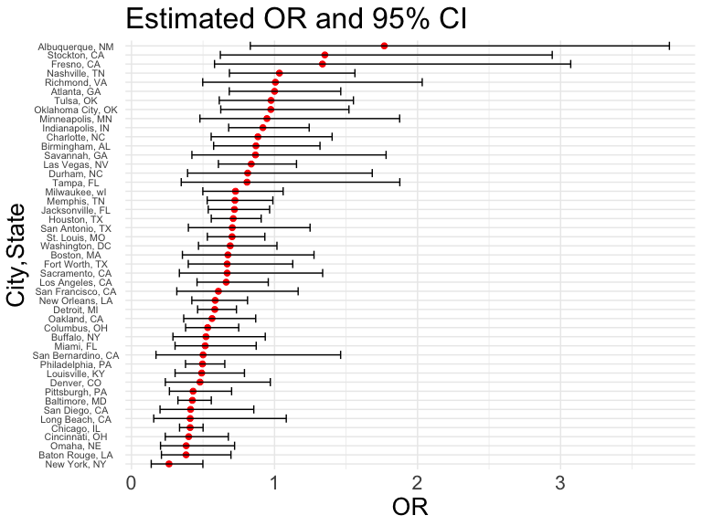
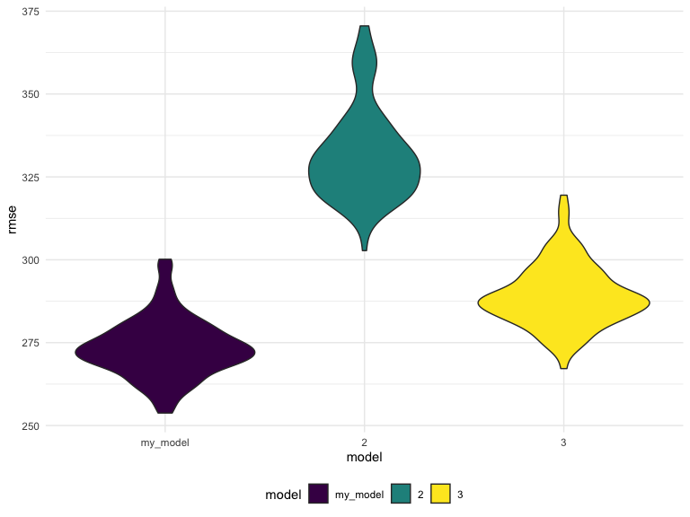

p8105_hw6_jy3269
================
Jingyi Yao
2022-12-03

## Problem 1

To obtain a distribution for $\hat{r}^2$, we’ll follow basically the
same procedure we used for regression coefficients: draw bootstrap
samples; the a model to each; extract the value I’m concerned with; and
summarize. Here, we’ll use `modelr::bootstrap` to draw the samples and
`broom::glance` to produce `r.squared` values.

``` r
weather_df = 
  rnoaa::meteo_pull_monitors(
    c("USW00094728"),
    var = c("PRCP", "TMIN", "TMAX"), 
    date_min = "2017-01-01",
    date_max = "2017-12-31") %>%
  mutate(
    name = recode(id, USW00094728 = "CentralPark_NY"),
    tmin = tmin / 10,
    tmax = tmax / 10) %>%
  select(name, id, everything())
```

    ## Registered S3 method overwritten by 'hoardr':
    ##   method           from
    ##   print.cache_info httr

    ## using cached file: ~/Library/Caches/R/noaa_ghcnd/USW00094728.dly

    ## date created (size, mb): 2022-09-06 10:41:07 (8.397)

    ## file min/max dates: 1869-01-01 / 2022-09-30

``` r
weather_df %>% 
  modelr::bootstrap(n = 1000) %>% 
  mutate(
    models = map(strap, ~lm(tmax ~ tmin, data = .x) ),
    results = map(models, broom::glance)) %>% 
  select(-strap, -models) %>% 
  unnest(results) %>% 
  ggplot(aes(x = r.squared)) + geom_density()
```


In this example, the $\hat{r}^2$ value is high, and the upper bound at 1
may be a cause for the generally skewed shape of the distribution. If we
wanted to construct a confidence interval for $R^2$, we could take the
2.5% and 97.5% quantiles of the estimates across bootstrap samples.
However, because the shape isn’t symmetric, using the mean +/- 1.96
times the standard error probably wouldn’t work well.

We can produce a distribution for $\log(\beta_0 * \beta1)$ using a
similar approach, with a bit more wrangling before we make our plot.

``` r
weather_df %>% 
  modelr::bootstrap(n = 1000) %>% 
  mutate(
    models = map(strap, ~lm(tmax ~ tmin, data = .x) ),
    results = map(models, broom::tidy)) %>% 
  select(-strap, -models) %>% 
  unnest(results) %>% 
  select(id = `.id`, term, estimate) %>% 
  pivot_wider(
    names_from = term, 
    values_from = estimate) %>% 
  rename(beta0 = `(Intercept)`, beta1 = tmin) %>% 
  mutate(log_b0b1 = log(beta0 * beta1)) %>% 
  ggplot(aes(x = log_b0b1)) + geom_density()
```


As with $r^2$, this distribution is somewhat skewed and has some
outliers.

The point of this is not to say you should always use the bootstrap –
it’s possible to establish “large sample” distributions for strange
parameters / values / summaries in a lot of cases, and those are great
to have. But it is helpful to know that there’s a way to do inference
even in tough cases.

 
 
## Problem 2

### 1. Create `city_state` variable and a binary `solved` variable

``` r
raw_data <- read_csv("./data/homicide-data.csv",show_col_types = FALSE)
homicide <- raw_data %>% 
  mutate(
    city_state = str_c(city,", ",state),
    solved = ifelse(disposition == "Closed by arrest",1,0)) %>% 
  mutate(
      victim_sex = fct_relevel(victim_sex, "Female"),
      victim_race = fct_relevel(victim_race, "White"),
         ) 

homicide
```

    ## # A tibble: 52,179 × 14
    ##    uid   repor…¹ victi…² victi…³ victi…⁴ victi…⁵ victi…⁶ city  state   lat   lon
    ##    <chr>   <dbl> <chr>   <chr>   <fct>   <chr>   <fct>   <chr> <chr> <dbl> <dbl>
    ##  1 Alb-…  2.01e7 GARCIA  JUAN    Hispan… 78      Male    Albu… NM     35.1 -107.
    ##  2 Alb-…  2.01e7 MONTOYA CAMERON Hispan… 17      Male    Albu… NM     35.1 -107.
    ##  3 Alb-…  2.01e7 SATTER… VIVIANA White   15      Female  Albu… NM     35.1 -107.
    ##  4 Alb-…  2.01e7 MENDIO… CARLOS  Hispan… 32      Male    Albu… NM     35.1 -107.
    ##  5 Alb-…  2.01e7 MULA    VIVIAN  White   72      Female  Albu… NM     35.1 -107.
    ##  6 Alb-…  2.01e7 BOOK    GERALD… White   91      Female  Albu… NM     35.2 -107.
    ##  7 Alb-…  2.01e7 MALDON… DAVID   Hispan… 52      Male    Albu… NM     35.1 -107.
    ##  8 Alb-…  2.01e7 MALDON… CONNIE  Hispan… 52      Female  Albu… NM     35.1 -107.
    ##  9 Alb-…  2.01e7 MARTIN… GUSTAVO White   56      Male    Albu… NM     35.1 -107.
    ## 10 Alb-…  2.01e7 HERRERA ISRAEL  Hispan… 43      Male    Albu… NM     35.1 -107.
    ## # … with 52,169 more rows, 3 more variables: disposition <chr>,
    ## #   city_state <chr>, solved <dbl>, and abbreviated variable names
    ## #   ¹​reported_date, ²​victim_last, ³​victim_first, ⁴​victim_race, ⁵​victim_age,
    ## #   ⁶​victim_sex

## 2. Omit cities : Dallas, TX; Phoenix, AZ; and Kansas City, MO and Tulsa, AL

``` r
homicide <- homicide %>% 
  filter(city_state != "Dallas, TX", city_state != "Phoenix, AZ", city_state != "Kansas City, MO", city_state != "Tulsa, AL")
```

## 3. Limit your analysis those for whom victim_race is white or black

``` r
homicide <- homicide %>% 
  filter(victim_race == "White" | victim_race == "Black") %>% 
  mutate(victim_age = as.numeric(victim_age))
```

## 4. Select the predictors and response variable in Baltimore

``` r
baltimore_df = 
  homicide %>% 
  filter(city == "Baltimore") %>% 
  select(solved, victim_age, victim_race, victim_sex)

baltimore_df
```

    ## # A tibble: 2,753 × 4
    ##    solved victim_age victim_race victim_sex
    ##     <dbl>      <dbl> <fct>       <fct>     
    ##  1      0         17 Black       Male      
    ##  2      0         26 Black       Male      
    ##  3      0         21 Black       Male      
    ##  4      1         61 White       Male      
    ##  5      1         46 Black       Male      
    ##  6      1         27 Black       Male      
    ##  7      1         21 Black       Male      
    ##  8      1         16 Black       Male      
    ##  9      1         21 Black       Male      
    ## 10      1         44 Black       Female    
    ## # … with 2,743 more rows

## 5. Fit logistic regression for Baltimore

``` r
Baltimore_logistic = 
  baltimore_df %>% 
  glm(solved ~ victim_age + victim_race + victim_sex, data = ., family = binomial())
```

## 6. Save the Baltimore model result as an R Object

``` r
save(Baltimore_logistic, file = "./result/Baltimore_logistic.RData")
```

## 7. Tidy the object

``` r
Baltimore_logistic %>% 
  broom::tidy() %>% 
  knitr::kable(digits = 3)
```

| term             | estimate | std.error | statistic | p.value |
|:-----------------|---------:|----------:|----------:|--------:|
| (Intercept)      |    1.152 |     0.237 |     4.865 |   0.000 |
| victim_age       |   -0.007 |     0.003 |    -2.024 |   0.043 |
| victim_raceBlack |   -0.842 |     0.175 |    -4.818 |   0.000 |
| victim_sexMale   |   -0.854 |     0.138 |    -6.184 |   0.000 |

## 8. Get the 95% CI of OR

``` r
alpha = 0.05

Baltimore_logistic %>% 
  broom::tidy() %>%
  mutate(OR = exp(estimate),
         OR_lower = exp(estimate - 1.96*std.error),
         OR_upper = exp(estimate + 1.96*std.error) ) %>%
  filter(term == 'victim_sexMale') %>% 
  select(estimate, OR,OR_lower,OR_upper) %>% 
  knitr::kable(digits = 3)
```

| estimate |    OR | OR_lower | OR_upper |
|---------:|------:|---------:|---------:|
|   -0.854 | 0.426 |    0.325 |    0.558 |

The OR result shows that male victims in the homicides have a lower
chance to have the case solved compared with women.

## 9. Define a `glm_all()` function

``` r
glm_all = function(citystate){
  city_glm = homicide %>% 
    filter(city_state == citystate) %>% 
    glm(solved ~ victim_sex + victim_race + victim_age, family = binomial, data = .) %>% 
    broom::tidy() %>% 
    mutate(
         OR = exp(estimate), 
         OR_lower = exp(estimate - 1.96*std.error), 
         OR_upper = exp(estimate + 1.96*std.error)) %>% 
    filter(term == "victim_sexMale") %>% 
    select(OR, OR_lower, OR_upper)
    
    city_glm
}
```

## 10. apply `glm_all()` to all the cities and tidy the result

``` r
city_state_list = homicide %>% 
  select(city_state) %>% 
  unique()

glm_all_result = city_state_list %>% 
  mutate(glm_result = map(city_state, glm_all)) %>% 
  unnest(glm_result) %>% 
  arrange(desc(OR)) 

glm_all_result %>%  knitr::kable(digits = 3)
```

| city_state         |    OR | OR_lower | OR_upper |
|:-------------------|------:|---------:|---------:|
| Albuquerque, NM    | 1.767 |    0.831 |    3.761 |
| Stockton, CA       | 1.352 |    0.621 |    2.942 |
| Fresno, CA         | 1.335 |    0.580 |    3.071 |
| Nashville, TN      | 1.034 |    0.685 |    1.562 |
| Richmond, VA       | 1.006 |    0.498 |    2.033 |
| Atlanta, GA        | 1.000 |    0.684 |    1.463 |
| Tulsa, OK          | 0.976 |    0.614 |    1.552 |
| Oklahoma City, OK  | 0.974 |    0.624 |    1.520 |
| Minneapolis, MN    | 0.947 |    0.478 |    1.875 |
| Indianapolis, IN   | 0.919 |    0.679 |    1.242 |
| Charlotte, NC      | 0.884 |    0.557 |    1.403 |
| Birmingham, AL     | 0.870 |    0.574 |    1.318 |
| Savannah, GA       | 0.867 |    0.422 |    1.780 |
| Las Vegas, NV      | 0.837 |    0.608 |    1.154 |
| Durham, NC         | 0.812 |    0.392 |    1.683 |
| Tampa, FL          | 0.808 |    0.348 |    1.876 |
| Milwaukee, wI      | 0.727 |    0.499 |    1.060 |
| Memphis, TN        | 0.723 |    0.529 |    0.988 |
| Jacksonville, FL   | 0.720 |    0.537 |    0.966 |
| Houston, TX        | 0.711 |    0.558 |    0.907 |
| San Antonio, TX    | 0.705 |    0.398 |    1.249 |
| St. Louis, MO      | 0.703 |    0.530 |    0.932 |
| Washington, DC     | 0.690 |    0.468 |    1.017 |
| Boston, MA         | 0.674 |    0.356 |    1.276 |
| Fort Worth, TX     | 0.669 |    0.397 |    1.127 |
| Sacramento, CA     | 0.669 |    0.335 |    1.337 |
| Los Angeles, CA    | 0.662 |    0.458 |    0.956 |
| San Francisco, CA  | 0.608 |    0.317 |    1.165 |
| New Orleans, LA    | 0.585 |    0.422 |    0.811 |
| Detroit, MI        | 0.582 |    0.462 |    0.734 |
| Oakland, CA        | 0.563 |    0.365 |    0.868 |
| Columbus, OH       | 0.532 |    0.378 |    0.750 |
| Buffalo, NY        | 0.521 |    0.290 |    0.935 |
| Miami, FL          | 0.515 |    0.304 |    0.872 |
| San Bernardino, CA | 0.500 |    0.171 |    1.462 |
| Philadelphia, PA   | 0.496 |    0.378 |    0.652 |
| Louisville, KY     | 0.491 |    0.305 |    0.790 |
| Denver, CO         | 0.479 |    0.236 |    0.971 |
| Pittsburgh, PA     | 0.431 |    0.265 |    0.700 |
| Baltimore, MD      | 0.426 |    0.325 |    0.558 |
| San Diego, CA      | 0.413 |    0.200 |    0.855 |
| Long Beach, CA     | 0.410 |    0.156 |    1.082 |
| Chicago, IL        | 0.410 |    0.336 |    0.501 |
| Cincinnati, OH     | 0.400 |    0.236 |    0.677 |
| Omaha, NE          | 0.382 |    0.203 |    0.721 |
| Baton Rouge, LA    | 0.381 |    0.209 |    0.695 |
| New York, NY       | 0.262 |    0.138 |    0.499 |

``` r
ggplot(glm_all_result, aes(y = fct_reorder(city_state, OR), x = OR)) +
  geom_point(color = "red", lwd = 2) +
  geom_errorbar(aes(xmin = OR_lower, xmax = OR_upper)) +
  labs(title = "Estimated OR and 95% CI") + ylab("City,State") + theme(axis.text.y = element_text(hjust = 0.5,size = 8), axis.text.x = element_text(size = 16), axis.title.x = element_text(size = 20), axis.title.y = element_text(size = 20),title = element_text(size = 20))
```



 
 
Comments on the plot :

-   Most of the estimated OR is less than 1. Thus, in most cities, the
    homicide whose victim is a male is less likely to be solved compared
    to those with a female victim.
-   Albuquerque, Stockton, Fresno, Nashville and Richmond have an
    estimated OR that is above 1. However, their 95% CI contains 1.
    Thus, we cannot conclude that there is significant difference
    between the odds of solving homicides for male and female victims in
    these cities.
-   Some cities’ 95% CI does not contain 1, which means that there are
    significant difference between the odds of solving homicides for
    male and female victims in these cities. For example, New York,
    Chicago are cities with CI that does not contain 1.

 
 
## Problem 3

``` r
data <- read_csv("./data/birthweight.csv")
```

### 1. Clean the data for regression analysis

``` r
birthwt <- data %>% 
  mutate(babysex = as.factor(babysex),
         frace = as.factor(frace),
         malform = as.factor(malform),
         mrace = as.factor(mrace)) %>%
  janitor::clean_names() %>% 
  select(bwt,everything())

# show the first 6 rows of the cleaned dataset
head(birthwt)
```

    ## # A tibble: 6 × 20
    ##     bwt babysex bhead blength delwt fincome frace gaweeks malform menarche
    ##   <dbl> <fct>   <dbl>   <dbl> <dbl>   <dbl> <fct>   <dbl> <fct>      <dbl>
    ## 1  3629 2          34      51   177      35 1        39.9 0             13
    ## 2  3062 1          34      48   156      65 2        25.9 0             14
    ## 3  3345 2          36      50   148      85 1        39.9 0             12
    ## 4  3062 1          34      52   157      55 1        40   0             14
    ## 5  3374 2          34      52   156       5 1        41.6 0             13
    ## 6  3374 1          33      52   129      55 1        40.7 0             12
    ## # … with 10 more variables: mheight <dbl>, momage <dbl>, mrace <fct>,
    ## #   parity <dbl>, pnumlbw <dbl>, pnumsga <dbl>, ppbmi <dbl>, ppwt <dbl>,
    ## #   smoken <dbl>, wtgain <dbl>

``` r
# check the missing values
sum(is.na(birthwt))
```

    ## [1] 0

Thus, the data has no missing values.

 
 
Next, I will fit my linear model using the cleaned data. I examined the
meaning of each variable and find it reasonable that all the variables
may be relevant to the birth weight of a baby. Thus, I plan to fit the
model using all the variables other than `bwt` (the response variable)
as predictors to build a full model first. Then I will use the step-wise
method to select significant variables backwards. The selected
predictors and the response variable will build up my regression model.

## 2. Fit a full model

``` r
full_model <- lm(bwt ~., data = birthwt)

broom::tidy(full_model) %>%  knitr::kable()
```

| term        |      estimate |   std.error |  statistic |   p.value |
|:------------|--------------:|------------:|-----------:|----------:|
| (Intercept) | -6265.3914076 | 660.4010631 | -9.4872522 | 0.0000000 |
| babysex2    |    28.7073088 |   8.4652447 |  3.3911966 | 0.0007021 |
| bhead       |   130.7781455 |   3.4523248 | 37.8811826 | 0.0000000 |
| blength     |    74.9535780 |   2.0216656 | 37.0751613 | 0.0000000 |
| delwt       |     4.1007326 |   0.3948202 | 10.3863301 | 0.0000000 |
| fincome     |     0.2898207 |   0.1795416 |  1.6142265 | 0.1065513 |
| frace2      |    14.3312853 |  46.1501283 |  0.3105362 | 0.7561682 |
| frace3      |    21.2361118 |  69.2959907 |  0.3064551 | 0.7592729 |
| frace4      |   -46.9962310 |  44.6782159 | -1.0518824 | 0.2929123 |
| frace8      |     4.2969242 |  74.0740827 |  0.0580085 | 0.9537446 |
| gaweeks     |    11.5493872 |   1.4653680 |  7.8815609 | 0.0000000 |
| malform1    |     9.7649680 |  70.6258929 |  0.1382633 | 0.8900388 |
| menarche    |    -3.5507723 |   2.8950777 | -1.2264860 | 0.2200827 |
| mheight     |     9.7874130 |  10.3115672 |  0.9491683 | 0.3425881 |
| momage      |     0.7593479 |   1.2221417 |  0.6213256 | 0.5344182 |
| mrace2      |  -151.4354038 |  46.0453432 | -3.2888321 | 0.0010141 |
| mrace3      |   -91.3866079 |  71.9189677 | -1.2706885 | 0.2039079 |
| mrace4      |   -56.4787268 |  45.1368828 | -1.2512766 | 0.2109013 |
| parity      |    95.5411137 |  40.4792711 |  2.3602479 | 0.0183069 |
| pnumlbw     |            NA |          NA |         NA |        NA |
| pnumsga     |            NA |          NA |         NA |        NA |
| ppbmi       |     4.3537865 |  14.8913292 |  0.2923706 | 0.7700173 |
| ppwt        |    -3.4715550 |   2.6121254 | -1.3290155 | 0.1839131 |
| smoken      |    -4.8543629 |   0.5870549 | -8.2690107 | 0.0000000 |
| wtgain      |            NA |          NA |         NA |        NA |

## 3. Select variables in the full model

``` r
stepwise_model <- MASS::stepAIC(full_model, direction = "backward", trace = FALSE)

broom::tidy(stepwise_model) %>%  knitr::kable()
```

| term        |      estimate |   std.error |  statistic |   p.value |
|:------------|--------------:|------------:|-----------:|----------:|
| (Intercept) | -6098.8219113 | 137.5463421 | -44.340124 | 0.0000000 |
| babysex2    |    28.5580171 |   8.4548958 |   3.377690 | 0.0007374 |
| bhead       |   130.7770408 |   3.4465672 |  37.944144 | 0.0000000 |
| blength     |    74.9471109 |   2.0190479 |  37.120027 | 0.0000000 |
| delwt       |     4.1067316 |   0.3920592 |  10.474775 | 0.0000000 |
| fincome     |     0.3180229 |   0.1747477 |   1.819898 | 0.0688436 |
| gaweeks     |    11.5924873 |   1.4620657 |   7.928842 | 0.0000000 |
| mheight     |     6.5940377 |   1.7848817 |   3.694383 | 0.0002231 |
| mrace2      |  -138.7924801 |   9.9070869 | -14.009414 | 0.0000000 |
| mrace3      |   -74.8867755 |  42.3146313 |  -1.769761 | 0.0768374 |
| mrace4      |  -100.6781427 |  19.3246910 |  -5.209819 | 0.0000002 |
| parity      |    96.3046933 |  40.3362158 |   2.387549 | 0.0170038 |
| ppwt        |    -2.6755853 |   0.4273585 |  -6.260752 | 0.0000000 |
| smoken      |    -4.8434197 |   0.5855757 |  -8.271210 | 0.0000000 |

 
 
As is shown in the stepwise_model result, the selected predictors are :
babysex, bhead, blength, delwt, fincome, gaweeks, mheight, mrace,
parity, ppwt, smoken.

 
The residual against fitted value plot is shown below.

## 4. Plot residuals vs. fitted values

``` r
birthwt %>%  
  add_predictions(stepwise_model) %>% 
  add_residuals(stepwise_model) %>% 
  ggplot(aes(x = pred, y = resid)) + geom_point() +
  labs(title = "Residuals vs Fitted Values ", ) + xlab("Fitted Value") + ylab("Residuals")
```


## 5. Split dataset

``` r
cv_df = 
  crossv_mc(birthwt, 100) %>% 
  mutate(
    train = map(train, as_tibble), 
    test = map(test, as_tibble))
```

## 6. Compare the 3 models – mean rmse

``` r
cv_df %>% 
  mutate(
    my_model  = map(train, ~lm(bwt ~ babysex + bhead + blength + delwt + fincome + 
    gaweeks + mheight + mrace + parity + ppwt + smoken, data = .x)),
    model_2  = map(train, ~lm(bwt ~ gaweeks + blength, data = .x)),
    model_3  = map(train, ~lm(bwt ~ bhead*blength*babysex, data = .x))) %>% 
  mutate(
    rmse_my_model = map2_dbl(my_model, test, ~rmse(model = .x, data = .y)),
    rmse_2    = map2_dbl(model_2, test, ~rmse(model = .x, data = .y)),
    rmse_3 = map2_dbl(model_3, test, ~rmse(model = .x, data = .y))) %>% 
  summarize(
    avg_rmse_my_model = mean(rmse_my_model),
    avg_rmse_model_2 = mean(rmse_2),
    avg_rmse_model_3  = mean(rmse_3)
  ) %>% 
  knitr::kable()
```

| avg_rmse_my_model | avg_rmse_model_2 | avg_rmse_model_3 |
|------------------:|-----------------:|-----------------:|
|          273.4095 |         331.7278 |         289.1438 |

``` r
cv_df %>% 
  mutate(
    my_model  = map(train, ~lm( bwt ~ babysex + bhead + blength + delwt + fincome + 
    gaweeks + mheight + mrace + parity + ppwt + smoken, data = .x)),
    model_2  = map(train, ~lm(bwt ~ gaweeks + blength, data = .x)),
    model_3  = map(train, ~lm(bwt ~ bhead*blength*babysex, data = .x))) %>% 
  mutate(
    rmse_my_model = map2_dbl(my_model, test, ~rmse(model = .x, data = .y)),
    rmse_2    = map2_dbl(model_2, test, ~rmse(model = .x, data = .y)),
    rmse_3 = map2_dbl(model_3, test, ~rmse(model = .x, data = .y))) %>%
  select(starts_with("rmse")) %>%  
  pivot_longer(
    everything(),
    names_to = "model", 
    values_to = "rmse",
    names_prefix = "rmse_") %>% 
  mutate(model = fct_inorder(model)) %>% 
  ggplot(aes(x = model, y = rmse)) + geom_violin(aes(fill = model))
```



 
 
According to the table and violin plot above, we know that my model has
the lowest mean RMSE. The main effect model (model 2) has the highest
RMSE. The interaction model (model 3) has RMSE slightly higher than my
model.
